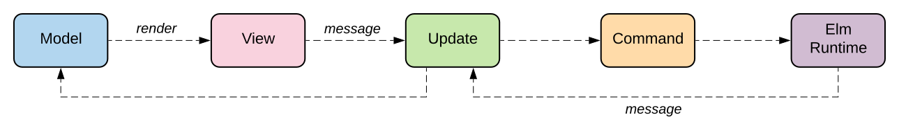

<!-- .slide: data-background="#000000" -->
## Model - View - Update

UiT INF-3910-5

---

### History

* Functional Reactive Programming
    * Events and Signals/Behaviors
    * Hudak & Elliot, 1997
* Elm language (Czaplicki 2012)
* MVU and FRP (Freeman)

---

### Simple MVU pattern


* Model: state
* View: Model -> (dispatch : Msg -> unit) -> unit
* Update: Msg -> Model -> Model

---

### Commands



* Model: state
* View: Model -> (dispatch : Msg -> unit) -> unit
* Update: Msg -> Model -> Model * Cmd

---

### Runtime

```fsharp
let run model view update =
    let mvu = MailboxProcessor.Start (fun inbox ->
        let rec loop state =
            async {
                let! msg = inbox.Receive ()
                let state' =
                    let (model', cmd') = update msg state
                    view model' inbox.Post
                    cmd' |> List.iter inbox.Post
                    model'
                return! loop state'
            }
        loop model)
    mvu.Post Start
```

---

### Subscriptions


---

### Fable.Reaction


---

### Demo

---

<!-- .slide: data-background="#000000" -->
## End of MVU

Next: `Model-View-Update`

