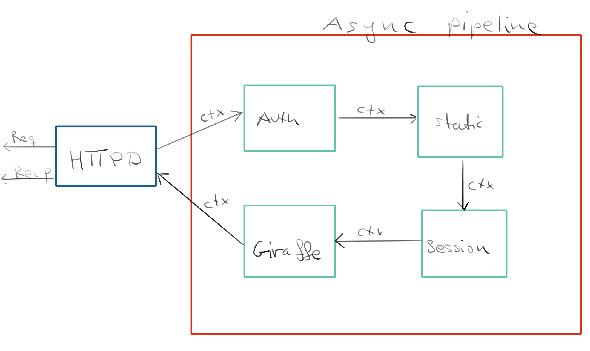
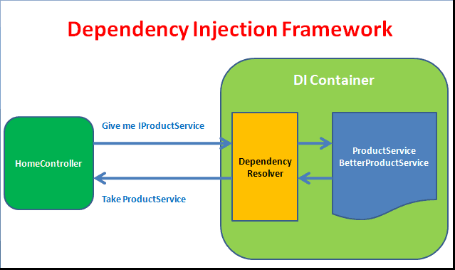

<!-- .slide: data-background="#000000" -->
## ASP.NET Core and Giraffe

UiT INF-3910-5

---

### Overview

* Web page vs. Web app
* Server side vs. client side rendering
* Hosted vs. unhosted

---

### Anatomy of web services



---

### Functional pipelines

```fsharp
type HttpContext = { ... }
type HttpFuncResult = Async<HttpContext option>
type HttpFunc = HttpContext -> HttpFuncResult

val (>>=) : HttpFuncResult -> HttpFunc -> HttpFuncResult
val (>=>) : HttpFunc -> HttpFunc -> HttpFunc

```

---

### Building web servers

* ASP.NET Core
* Giraffe (inspired by Suave)
* _Suave_ (inspired by Haskell)
* _Saturn_ (inspired by Phoenix)

---

### Communication

* Thoth
* _Fable.Remoting_
* _Elmish.Bridge_

---

### ASP.NET Core

* Performant
* Large collection of components
* Kestrel (and IIS)
* Microsoft

---

### Architecture of ASP.NET Core

* Middleware
* Builder pattern
* Delegates
* Dependency Injection
* Continuations

---

### Pipeline compositon

##### Binding

* Lots of unwrapping and wrapping of types
* Suboptimal performance
* Stack pressure
---

##### Continuations

* Avoids unwrapping and wrapping of types
* Tail-Call Optimization
* Early exit

---

### Functional pipelines

```fsharp
type HttpContext = { ... }
type HttpFuncResult = Async<HttpContext option>
type HttpFunc = HttpContext -> HttpFuncResult

type HttpHandler = HttpFunc -> HttpContext -> HttpFuncResult
type HttpHandler = HttpFunc -> HttpFunc

val (>=>) : HttpHandler -> HttpHandler -> HttpHandler
```

---

### Middleware


---

### Dependency Injection

##### Black magic



---


### Configuration

* `IApplicationBuilder` adds middleware to the pipline
* Middleware is configured using Dependency Injection
* Dependencies can be accessed from the `HttpContext`

```fsharp
let svc = ctx.GetService<IMyStuff> ()
```

---

### Giraffe

https://github.com/giraffe-fsharp/Giraffe

* ASP.NET Core Middleware
* Functional framework
* Inspired by Suave

---

### Demo

---

<!-- .slide: data-background="#000000" -->
## End of Fable

Next: `Persistence`

