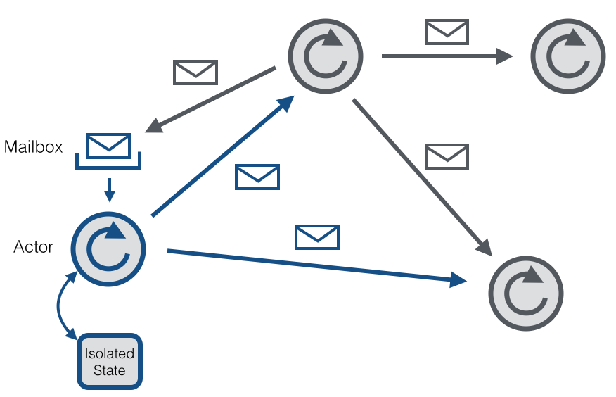

<!-- .slide: data-background="#000000" -->
## MailboxProcessor

UiT INF-3910-5

---

### Actor model

* The actor/agent model is a general mathematical model for (concurrent)
  computation [Hewitt]
* Actors communicate solely via message passing
* Actors can spawn actors, perform side effects and reply

---

### Actor model



---

### Usefulness

* Decoupling and Single-Responsibility Principle
* Shared data without locks
* Safe communication between threads
* Avoiding mutable state
* Robustness

---

### Notable examples

* Erlang and OTP
* Smalltalk
* RabbitMQ, AMQP, MQTT
* Akka and Orelans

---

### F# MailboxProcessor

* Light-weight *actor* based programming in F#
* It's a *message queue*, allowing objects to communicate via *message passing*
* Asynchronous, _serial_ processing of events in _order_

---

### F# MailboxProcessor

* Super light-weight compared to threads
* You can have many thousands of them
* No persistence
* Not across process boundaries

---

### Example 1

```fsharp
let actor = MailboxProcessor.Start (fun inbox ->
    let rec loop () =
        async {
            let! n = inbox.Receive ()
            printfn "received %d" n
            return! loop ()
        }
    loop ()
    )

actor.Post 42
```

---

### Example 2

```fsharp
let actor = MailboxProcessor.Start (fun inbox ->
    let rec loop state =
        async {
            let! n = inbox.Receive ()
            printfn "%d, %d" n state
            return! loop (state + n)
        }
    loop 0
    )

actor.Post 42
```

---

### Example 3

```fsharp
let actor = MailboxProcessor.Start (fun inbox ->
    let rec loop () =
        async {
            let! (reply, n) = inbox.Receive ()
            reply.Reply (n + 1)
            return! loop ()
        }
    loop ()
    )
let x = actor.PostAndReply (fun reply -> (reply, 42))
printfn "%d" x
```

---

### Demo

---

<!-- .slide: data-background="#000000" -->
## End of MailboxProcessor

Next: `Model-View-Update`

